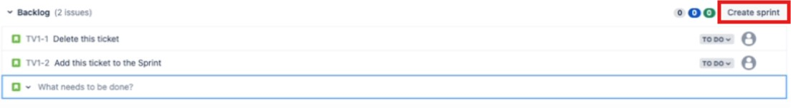
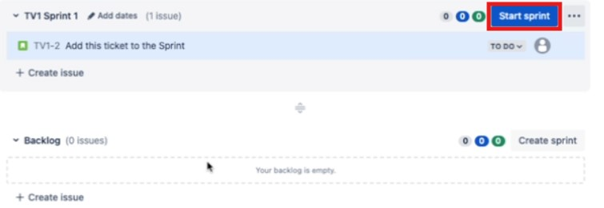
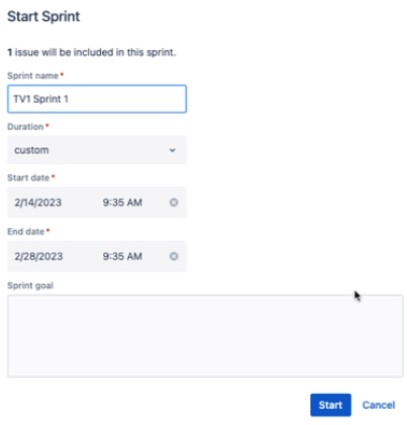

# Create, populate, and start a sprint in Jira

## Introduction
Sprints are a fundamental component of Agile project management. 
A sprint is a short period, typically one to four weeks, where your development team implements and delivers a discrete and potentially shippable milestone of a larger project.
By breaking down the project into smaller, time-boxed periods, your team can focus on delivering incremental improvements and continuously integrating testing and feedback. 

This guide provides step-by-step instructions for creating, populating, and starting a sprint in Jira.

## Prerequisites
* A Jira account with appropriate permissions.
* An existing Jira project that is type Scrum ([Create a Scrum project in Jira](www.google.com)).
* A backlog of issues that are available to add to the sprint ([Create and manage issues in Jira](www.google.com)).
   
## Create a sprint
1. From the Jira dashboard, select the project where you want to create a sprint.
2. On the side-menu of your project, click `Backlog`.
3. On the top-right corner of the backlog, click the `Create sprint` button.

## Populate the sprint
1. From the backlog of your project, select the issues that you want to include in the sprint.
2. Drag and drop these issues into the sprint section. You can drag issues up or down within the sprint to prioritize them.

> [!TIP]
> You can also add issues to your sprint by [editing an issue](www.google.com) and updating the `Sprint` field.

## Start the sprint
1. From the backlog of your project, click the `Start sprint` button.

2. In the modal that appears, configure the sprint details:
   * `Sprint Name`: Provide a meaningful name for your sprint.
   * `Duration`: Select a custom or predefined length for the sprint. 
   * `Start Date`: Set the start date for your sprint.
   * `End Date`: Set the end date for your sprint. If you selected a specific sprint duration, then this field is automatically populated.
   * `Sprint Goal`: Optionally, set a goal for the sprint to provide a clear focus for your team.
  

3. Click `Start` to begin the sprint.

Once you start a sprint, you will be brought to the [kanban board](www.google.com) for that sprint. Here, you can view and manage all issues that were assigned to the sprint. 
To access the kanban board at any time, click `Active sprints` on the side-menu of your project.

> [!NOTE]
> You can create multiple sprints to use for long term planning. However, you can have only **one active sprint** at a time.

During a sprint, you can monitor your team's progress by viewing the [sprint reports](wwww.google.com). 
Here, you can look at various charts and statistics about the sprint (e.g., *issue burndown rate*). 
